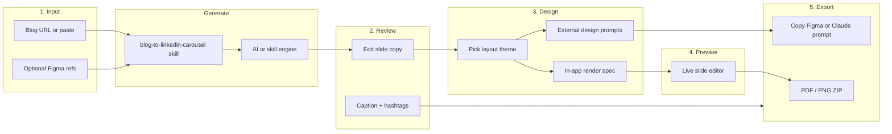
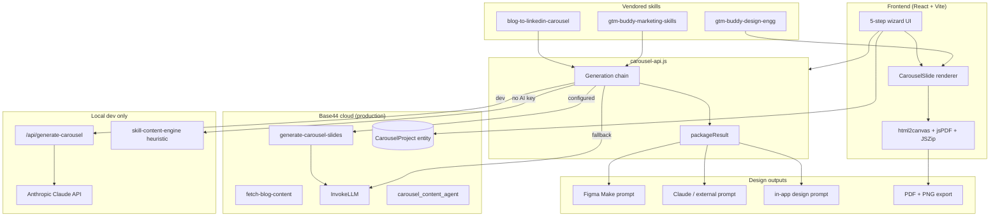
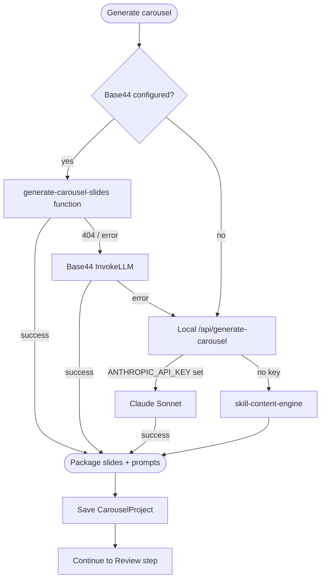

# Blog Carousel Studio

GTM Buddy internal Base44 app that turns blog content into branded LinkedIn carousel posts with PDF and PNG export.

## Features

- Paste a blog URL or full article text
- Skill-driven carousel copy (blog-to-linkedin-carousel + GTM Buddy marketing/design skills)
- AI generation via Base44 InvokeLLM or local Claude (Anthropic API)
- Editable review step with per-slide regenerate
- Dual design outputs: Figma Make / Claude prompts + in-app renderer
- GTM Buddy branded 1200×1200 slide preview with editable copy
- PDF download (one slide per page) and PNG ZIP export
- Project persistence via `CarouselProject` entity
- Phase 2 stubs for Figma reference URLs

## How it works

Five-step wizard from blog input to LinkedIn-ready assets.



### Wizard steps

| Step | What you do | What you get |
|------|-------------|--------------|
| **Input** | Paste blog or URL; optional reference frames | Generation mode indicator (Claude, Base44, or skill engine) |
| **Review** | Edit eyebrow, headline, body, closing line, visual notes | Carousel-native copy (not blog paragraphs) |
| **Design** | Choose theme; copy external or in-app design prompts | Figma Make prompt, Claude prompt, in-app renderer spec |
| **Preview** | Edit copy beside live 1200×1200 preview | Updated slides reflected in export |
| **Export** | Download PDF/PNG or copy prompts | LinkedIn-ready carousel package |

## Architecture



### Generation chain

When you click **Generate carousel**, the app tries each path in order until one succeeds:



### Repo layout

```
blog-carousel-studio/
├── base44/
│   ├── entities/carousel-project.jsonc
│   ├── functions/
│   │   ├── fetch-blog-content/
│   │   └── generate-carousel-slides/
│   └── agents/carousel_content_agent.jsonc
├── src/
│   ├── components/carousel/     # Slide renderer, preview, export, design panels
│   ├── components/wizard/       # Input + review steps
│   ├── lib/
│   │   ├── carousel-api.js      # Generation chain + save
│   │   ├── design-prompt.js     # Figma / Claude / in-app prompts
│   │   ├── skill-content-engine.js
│   │   └── skills/              # Vendored skill markdown
│   └── pages/Home.jsx           # Wizard orchestration
└── vite-plugin-llm-api.js       # Local Claude proxy (dev only)
```

## Local development (Claude / AI)

Carousel copy requires **either** a local Claude key **or** Base44. Without either, only a heuristic skill engine runs (not full AI).

```bash
npm install
cp .env.example .env.local
npm run check-setup
```

Edit `.env.local`:

```bash
# Option A — Claude on local dev (recommended)
ANTHROPIC_API_KEY=sk-ant-api03-...
# optional: ANTHROPIC_MODEL=claude-sonnet-4-20250514

# Option B — Base44 cloud AI (also set for local proxy)
VITE_BASE44_APP_ID=your_app_id
VITE_BASE44_APP_BASE_URL=https://your-app-name.base44.app
```

```bash
npm run dev
# Open http://localhost:5173 — Input step shows "Generation mode"
# Badge should say "Claude (local)" after generate when Option A is set
```

Get an Anthropic key: https://console.anthropic.com/settings/keys

## Base44 deployment (publish for team)

1. Create a new app in the [Base44 dashboard](https://base44.com) and connect this GitHub repo.
2. Copy **App ID** and **App URL** into `.env.local` (see above).
3. Deploy backend + frontend:

```bash
npx base44 login
npx base44 link          # link CLI to your Base44 app
npx base44 entities push
npx base44 functions deploy
npx base44 agents push
npm run build
npx base44 deploy
```

4. In Base44 dashboard **Authentication** ([app settings](https://app.base44.com/apps/6a2b00c80ec39d600a986eb4/editor/workspace/overview)):
   - Enable **Google login** for Gmail sign-in
   - Enable **SSO login** and configure your IdP for `@gtmbuddy.ai` email SSO
   - Set **internal access** (invite-only or `@gtmbuddy.ai` domain allowlist)
5. On Base44, `generate-carousel-slides` uses **Base44 InvokeLLM** (platform AI — no Anthropic key needed in production).
6. After GitHub sync, run `npx base44 deploy` so the live app picks up latest code (not just chat sync).

The hosted app requires sign-in before the wizard loads. Users see **Continue with Google**, **Continue with company email (SSO)**, or **Sign in with email** on the login screen.

## Base44 preview troubleshooting

**GitHub sync is not a deploy.** Syncing the repo into Base44 chat loads source files into context; it does **not** rebuild the preview iframe or deploy backend functions. After every sync from GitHub, run:

```bash
npx base44 login
npx base44 link
npx base44 entities push
npx base44 functions deploy   # required for InvokeLLM via generate-carousel-slides
npx base44 agents push
npx base44 deploy             # rebuilds preview from latest main
```

**Verify the preview is current:**

- Header shows build stamp (e.g. `build 2026-06-12-d`) — check the diagnostics panel on the Input step
- Wizard shows **5 steps** (Input → Review → Design → Preview → Export), not the old 4-step boilerplate
- Paste **50+ characters** and click **Generate carousel** — Review should show slides within ~1 second (skill engine)

**Generation modes on Base44:**

| Mode | Needs AI? | Notes |
|------|-----------|-------|
| Skill engine | No | Runs in the browser; always produces slides from pasted text |
| Base44 function | Yes (InvokeLLM) | Server-side via `generate-carousel-slides` — requires `npx base44 functions deploy` |
| Base44 InvokeLLM (frontend) | Yes | Fallback if function fails |

**Common issues:**

- **Empty Review step** — Preview is stale (re-run `npx base44 deploy`) or Generate was never clicked with enough text
- **401 / auth errors** — Sign in to Base44 in the preview; skill-engine slides still work without AI login
- **AI upgrade fails** — Run `npx base44 functions deploy`; an amber notice appears on Review but slides remain visible
- **No external API keys needed** on Base44 — production uses Base44 InvokeLLM only (no Groq/Gemini/Anthropic keys in the hosted app)

## Skill sync

Skills are vendored from [gtm-buddy-marketing-skills](https://github.com/GTM-Buddy-Marketing/gtm-buddy-marketing-skills) and applied in two layers:

1. **LLM prompts** — distilled rules from `content-strategy`, `copywriting`, `copy-editing`, `product-marketing`, `ad-creative`, and `social` (see `src/lib/prompts/marketing-skills-prompt.js`)
2. **Skill engine** — instant browser generation uses the same copy rules via `src/lib/copy-polish.js` and `src/lib/skill-content-engine.js`

When you have local clones of the skill repos:

```bash
git clone git@github.com:GTM-Buddy-Marketing/gtm-buddy-marketing-skills.git ../gtm-buddy-marketing-skills
chmod +x scripts/sync-skills.sh
./scripts/sync-skills.sh
npx base44 functions deploy
npx base44 agents push
```

## Components

| Layer | Piece | Role |
|-------|-------|------|
| **Entity** | `CarouselProject` | Stores drafts, slides, prompts, export status |
| **Functions** | `fetch-blog-content` | Fetches blog HTML from URL |
| **Functions** | `generate-carousel-slides` | Runs skill prompt via InvokeLLM |
| **Agent** | `carousel_content_agent` | Orchestrates blog → carousel workflow |
| **Frontend** | 5-step wizard | Input → Review → Design → Preview → Export |
| **Skills** | `blog-to-linkedin-carousel` | Slide structure, copy rules, Figma Make prompt |
| **Skills** | `gtm-buddy-marketing-skills` | Content governance, LinkedIn patterns |
| **Skills** | `gtm-buddy-design-engg` | GTM Buddy design tokens and themes |
